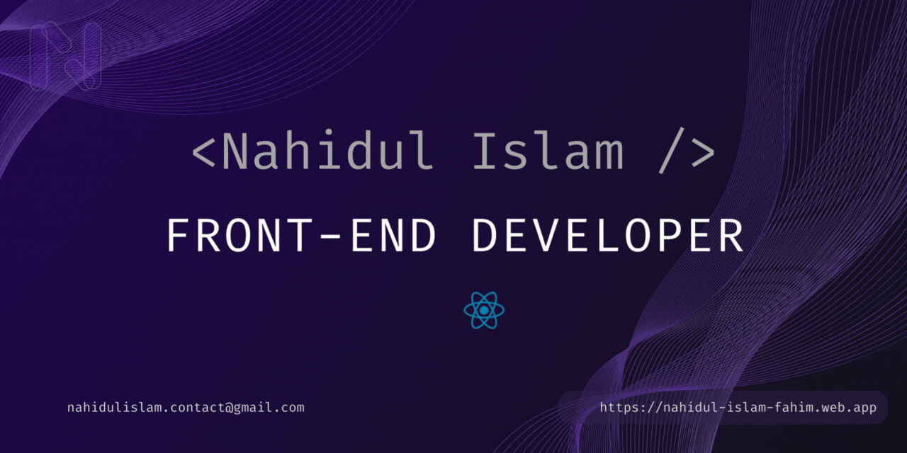

  

## 🙋‍♂️ About me

Hey there! 👋 I'm Nahidul Islam, a passionate MERN stack developer with a special love for React. Actively refining my skills with real-world MERN projects, I'm dedicated to staying on the cutting edge of technology.

 

### 🚀 What I Bring to the Table:

- **Aspiring Front-End Developer:** I specialize in crafting visually appealing and user-friendly interfaces. My commitment to creating engaging web experiences is evident in every project I tackle.

- **MERN Stack Explorer:** Proficient in the MERN stack (MongoDB, Express.js, React.js, Node.js), I enjoy building solid and scalable web applications, learning and growing with each line of code.

- **React Enthusiast:** I'm particularly excited about React and its component-based architecture. I believe it's the key to writing maintainable and efficient code that scales.

 

### 🌟 My Aspirations for the Next 2 Years:

Over the next two years, my goal is to evolve from a junior developer to a seasoned professional. I'm dedicated to continuous learning, tackling challenging projects, and refining my skills to contribute at a higher level. I'm thrilled about the journey of growth and development ahead!

 

### 💼 What I'm Looking For:

I'm actively seeking opportunities to collaborate on exciting MERN stack projects. I'm enthusiastic about learning and growing within a dynamic team environment. I'm ready to bring my skills and passion to a role that aligns with my goals for professional development. Let's collaborate and build something great together!

 

### **✉️ I'm Just an Email Away! [Drop me a line.](mailto:nahidulislam1196@gmail.com "Drop a email")**

  

## 💻 Tech Stack & Skills

    

  

### 🌐 Let's Connect:

  
  

Feel free to explore my repositories below and reach out if you're looking for an enthusiastic junior developer ready to bring creativity and a strong work ethic to your team.

  

## 🔍 Git Insights

 

  

## 📊 Git Activity

 

 

  

## 🌈 Discover My Recent Projects

 

### 📦 Glide Parcel (A parcel booking website)

 

**Live site**: [Glide parcel](https://glide-parcel.web.app)

Admin email: admin@admin.com

Admin password: Asdf$$

- A dynamic homepage, where all the statistics and deliveryman information coming from database
- Register / login system
- 3 different dashboard for 3 different of users (Admin, Delivery man, normal registered user)

  

### ☕ Sip-Savor Restaurant (A restaurant website)

 

**Live site**: [Sip savor restaurant](https://sip-savor-restaurant.web.app)

Admin email: admin@admin.com

Admin password: Asdf$$

- A dynamic homepage, where total orders and favourite menu information are coming from databse
- Register / login system
- 2 different dashboard for admin and normal users
- Admin can manage products from database
- JWT verification for security

  

### 🚙 Motor Mingle (A car selling website)

 

**Live site**: [Motor Mingle](https://motor-mingle.web.app)

Admin email: admin@admin.com

Admin password: Asdf$$

- A dynamic section in the homepage, where brand names are coming from database.
- Register / login system
- 2 different dashboard for admin and normal users
- Admin can manage products from database
- JWT verification for security
- Light/dark mode toggle