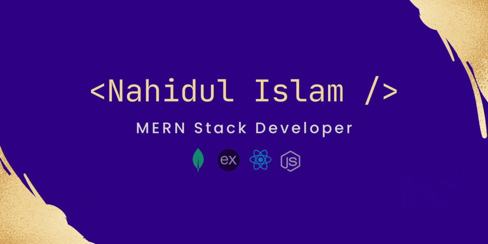

## 🙋‍♂️ About me

Hey there! 👋 I'm Nahidul Islam, a passionate MERN stack developer with a special love for React. Actively refining my skills with real-world MERN projects, I'm dedicated to staying on the cutting edge of technology.

 

### 🚀 What I Bring to the Table:

**Aspiring Front-End Developer:** I specialize in crafting visually appealing and user-friendly interfaces. My commitment to creating engaging web experiences is evident in every project I tackle.

**MERN Stack Explorer:** Proficient in the MERN stack (MongoDB, Express.js, React.js, Node.js), I enjoy building solid and scalable web applications, learning and growing with each line of code.

**React Enthusiast:** I'm particularly excited about React and its component-based architecture. I believe it's the key to writing maintainable and efficient code that scales.

 

### 🌟 My Aspirations for the Next 2 Years:

Over the next two years, my goal is to evolve from a junior developer to a seasoned professional. I'm dedicated to continuous learning, tackling challenging projects, and refining my skills to contribute at a higher level. I'm thrilled about the journey of growth and development ahead!

 

### 💼 What I'm Looking For:

I'm actively seeking opportunities to collaborate on exciting MERN stack projects. I'm enthusiastic about learning and growing within a dynamic team environment. I'm ready to bring my skills and passion to a role that aligns with my goals for professional development. Let's collaborate and build something great together! 🌐

 

### 🌐 Let's Connect:

  <link
  rel="stylesheet"
  href="https://cdn.jsdelivr.net/gh/dheereshagrwal/colored-icons@1.7.3/src/app/ci.min.css"
  />
  <a href="https://google.com">
<i class="ci ci-nuxtjs ci-5x"></i>
</a>

