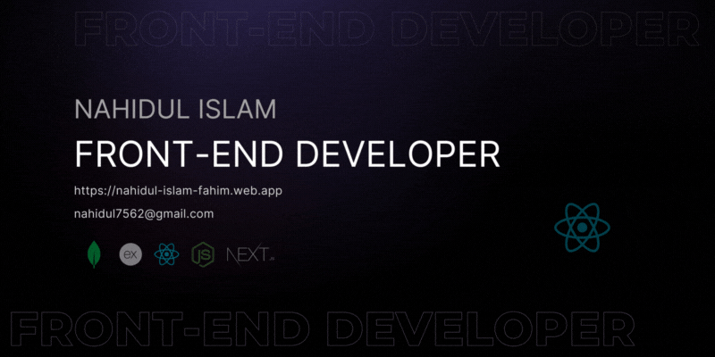

 

 

## 🙋‍♂️ About me

Hey there! 👋 I'm Nahidul Islam, a passionate MERN stack developer hailing from the vibrant city of Chattogram, Bangladesh. With a keen eye for detail and a love for crafting seamless user experiences, I specialize in the front end, with a strong focus on React.js and Next.js.

 

* I'm currently working on [Bongo Blend](https://github.com/nahidul-fahim/bongo-blend "Bongo Blend Project")
* I'm currently learning **Next.js, Redux**
* You can reach me here: [nahidul7562@gmail.com](mailto:nahidul7562@gmail.com "Drop an email")
* [Visit my portfolio](https://nahidul-islam-fahim.web.app "Portfolio website")

 

## 🚀 What I Bring to the Table:

- **Aspiring Front-End Developer:** I specialize in crafting visually appealing and user-friendly interfaces. My commitment to creating engaging web experiences is evident in every project I tackle.

- **React Enthusiast:** I'm particularly excited about React and its component-based architecture. I believe it's the key to writing maintainable and efficient code that scales.

- **MERN Stack Explorer:** Proficient in the MERN stack (MongoDB, Express.js, React.js, Node.js), I enjoy building solid and scalable web applications, learning and growing with each line of code.

 

## 🌟 My Aspirations for the Next 2 Years:

Over the next two years, my goal is to evolve from a junior developer to a seasoned professional. I'm dedicated to continuous learning, tackling challenging projects, and refining my skills to contribute at a higher level. I'm thrilled about the journey of growth and development ahead!

 

## 💼 What I'm Looking For:

I'm actively seeking opportunities to collaborate on exciting front-end projects. I'm enthusiastic about learning and growing within a dynamic team environment. I'm ready to bring my skills and passion to a role that aligns with my goals for professional development. Let's collaborate and build something great together!

  

## 💻 Tech Stack & Skills

  
    
  

  

## 🌐 Let's Connect:

  

  

Feel free to explore my repositories below and reach out if you're looking for an enthusiastic junior developer ready to bring creativity and a strong work ethic to your team.

  

## 🔍 Git Insights

  

## 📊 Git Activity

 

## 🌈 Discover My Best Projects

 

### ☕ Caffeina Haven (An online restaurant management platform)

* **Live site**: [Caffeina Haven](https://caffeina-haven.web.app)
* [Visit repo for more details.](https://github.com/nahidul-fahim/caffeina-haven-client).

  

### 🚙 Motor Mingle (A car selling website)

* **Live site**: [Motor Mingle](https://motor-mingle.web.app)
* [Visit repo for more details.](https://github.com/nahidul-fahim/motor-mingle-client).

  

### 📦 Glide Parcel (A parcel booking website)

* **Live site**: [Glide parcel](https://glide-parcel.web.app)
* [Visit repo for more details.](https://github.com/nahidul-fahim/glide-parcel-client).